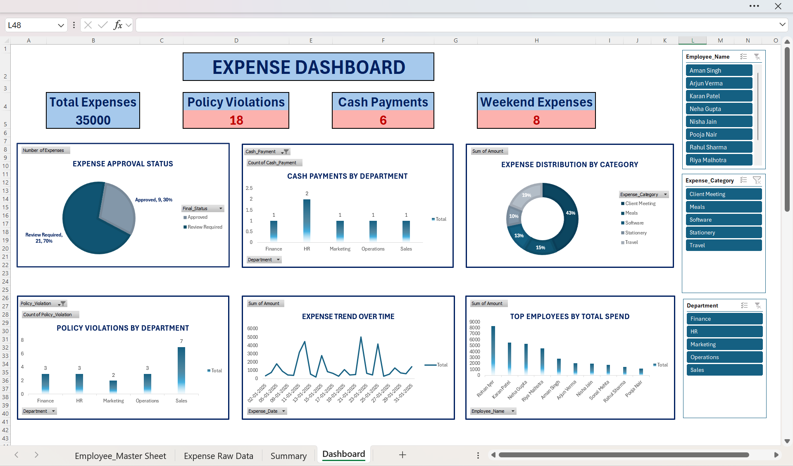

# Expense Report Automation & Interactive Dashboard (Excel)
## Dashboard Preview

## Project Overview
This project focuses on automating the validation of corporate expense reports and presenting actionable insights through an interactive Excel dashboard.  
The solution simulates a real-world finance and expense review process by identifying non-compliant and high-risk transactions and summarizing spend patterns across departments and employees.
The project demonstrates practical skills in Excel automation, financial analysis, reporting, and dashboarding.
---
## Business Problem
Manual expense review is time-consuming, error-prone, and inefficient, especially when organizations deal with large volumes of employee expense claims.  
Finance and audit teams require automated checks and visual summaries to quickly identify:
- Policy violations  
- Missing supporting documents  
- High-risk payment methods  
- Unusual spending patterns  
This project addresses these challenges by automating validation logic and consolidating insights into a single, interactive dashboard.
---
## Dataset Description
- Simulated corporate expense data for **30 employee transactions**
- Departments covered: Sales, Finance, HR, Marketing, Operations
- Expense categories include:
 - Travel  
 - Meals  
 - Client Meetings  
 - Stationery  
 - Software
- Each record includes expense amount, policy limits, bill attachment status, payment mode, and transaction date
*Note: The dataset is fully mock data created for demonstration purposes.*
---
## Approach & Methodology
### 1. Data Preparation
- Created a structured expense dataset representing real corporate claims
- Standardized fields to ensure consistency across records
### 2. Automated Validation Checks
Implemented rule-based validation using Excel formulas to flag:
- **Policy Violations** (expense amount exceeding policy limits)
- **Missing Bills** (claims without supporting documents)
- **Cash Payments** (higher fraud and compliance risk)
- **Weekend Expenses** (potential non-business transactions)
A consolidated approval logic was applied to classify expenses as:
- **Approved**
- **Review Required**
---
## Dashboard & Analytics
An interactive dashboard was developed using Pivot Tables, Charts, and Slicers to provide management-level insights.
### Key Dashboard Components
- **KPI Cards**:
 - Total Expenses
 - Total Policy Violations
 - Total Cash Payments
 - Total Weekend Expenses
- **Visual Analytics**:
 - Expense approval status breakdown
 - Department-wise policy violations
 - Cash payment distribution by department
 - Top employees by total expense amount
 - Expense category-wise spend analysis
 - Time-based expense trend analysis
- **Interactivity**:
 - Slicers to filter data by Department, Employee, and Expense Category
 - Dynamic updates across all visuals
---
## Key Insights
- A significant portion of expenses required additional review due to policy breaches
- Sales and Marketing departments accounted for the majority of high-value and non-compliant claims
- Cash-based expenses were concentrated in specific departments, indicating higher compliance risk
- A small group of employees contributed disproportionately to overall spend
---
## Tools & Skills Used
- Microsoft Excel  
- Advanced Excel Formulas (IF, COUNTIF, WEEKDAY, logical functions)  
- Pivot Tables & Pivot Charts  
- Interactive Slicers  
- KPI Design & Dashboard Layout  
- Financial Analysis & Reporting  
---
## Project Outcomes
- Demonstrated how Excel-based automation can reduce manual expense review effort
- Enabled quick identification of high-risk transactions and compliance issues
- Delivered a centralized, interactive reporting view for finance and management teams
---
## Files Included
- **Expense_Report_Automation.xlsx** – Main working file with automation logic and dashboard  
- **Project_Overview.pdf** – Detailed explanation of project objectives, approach, and insights  
- **Expense_Dashboard_Screenshots.pdf** – Visual snapshots of the interactive dashboard  
---
## Role Relevance
This project is relevant for the following roles:
- Financial Analyst  
- MIS / Reporting Analyst  
- Expense / T&E Analyst  
- Risk & Compliance Analyst  
- Audit Support / Finance Operations roles  
---
## Disclaimer
This project is created for learning and portfolio demonstration purposes using mock data and does not represent any real organization or confidential information.
